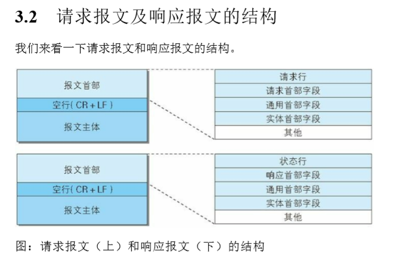
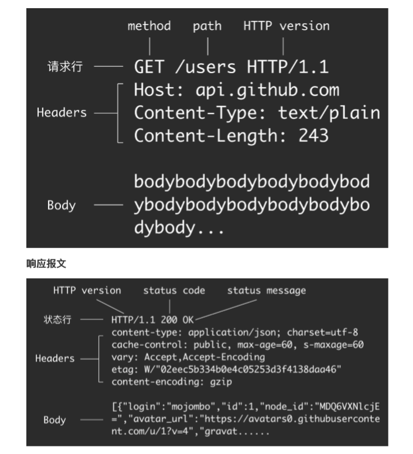
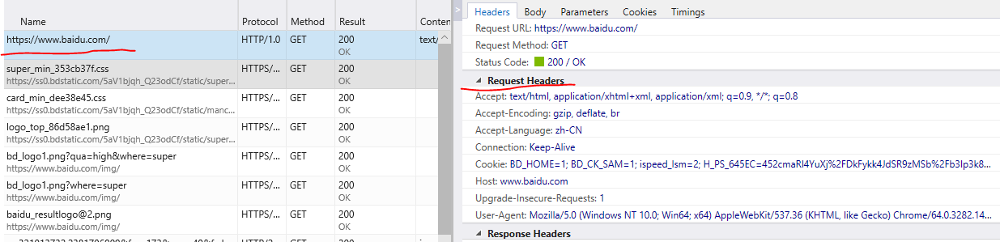
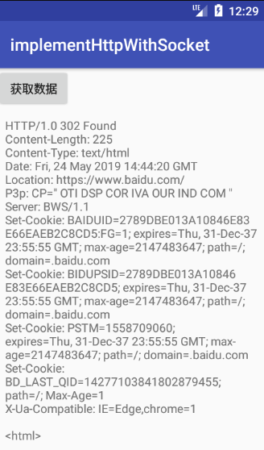
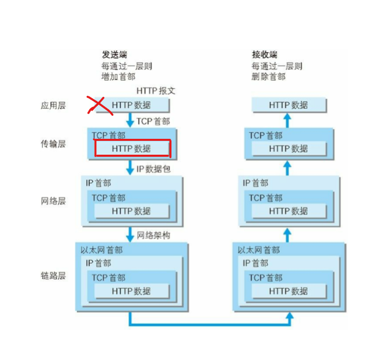

# implementHttpWithSocket
用socket发http请求，并收到回复。
## 为什么要用socket实现一个访问百度的http请求呢？
答：为了深入理解http就是一个规则。<br>
<br>
再具体一点：<br>
<br>
请求&响应：
```java
报文首部
空行
报文主体
```
## 怎么样去实现呢？
先从Chrome浏览器，复制请求百度的请求参数：
<br>
之后编写程序：
```java
/**
 *  用socket发http请求，并收到回复。
 * @author chengxiaobo
 * @time 2019/5/24 21:50
 */
class MainActivity : AppCompatActivity() {

    var handler: Handler? = null
    val MESSAGE_RECEIVER = 2
    val TAG = "MainActivity"
    override fun onCreate(savedInstanceState: Bundle?) {
        super.onCreate(savedInstanceState)
        setContentView(R.layout.activity_main)
        btnGetData.setOnClickListener {
            //请求数据
            getDataWithSockect()
        }

        handler = @SuppressLint("HandlerLeak")
        object : Handler() {
            override fun handleMessage(msg: Message?) {
                super.handleMessage(msg)
                msg?.let {
                    if (it.what == MESSAGE_RECEIVER) {
                        tvData.append(msg.obj.toString())
                        tvData.append("\n")
                    }
                }
            }
        }
    }

    private fun getDataWithSockect() {
        object : Thread() {
            override fun run() {
                super.run()
                connectToTcpServer()
            }
        }.start()
    }

    private fun connectToTcpServer() {
        var socket: Socket? = null
        var printWriter: PrintWriter? = null
        while (socket == null) {
            try {
                socket = Socket("www.baidu.com", 80)
                printWriter = PrintWriter(BufferedWriter(OutputStreamWriter(socket.getOutputStream())), true)
                printWriter.println("GET / HTTP/1.0\n" +
                        "host: www.baidu.com\n" +
                        "Accept: text/html, application/xhtml+xml, application/xml; q=0.9, */*; q=0.8\n" +
                        "Accept-Encoding: gzip, deflate, br\n" +
                        "Accept-Language: zh-CN\n" +
                        "Connection: Keep-Alive\n" +
                        "User-Agent: Mozilla/5.0 (Windows NT 10.0; Win64; x64) AppleWebKit/537.36 (KHTML, like Gecko) Chrome/64.0.3282.140 Safari/537.36 Edge/18.17763\n\n")
            } catch (e: IOException) {
                SystemClock.sleep(1000)
                log(TAG, "connect tcp server failed, retry...")
            }
        }

        try {
            val bufferedReader = BufferedReader(InputStreamReader(socket.getInputStream()))
            while (!MainActivity@ this.isFinishing) {
                val msg = bufferedReader.readLine()
                msg?.let {
                    handler?.obtainMessage(MESSAGE_RECEIVER, msg)?.sendToTarget()
                    log(TAG, msg)
                }
            }

            close(printWriter)
            close(bufferedReader)
            socket.close()

        } catch (e: IOException) {
            e.printStackTrace()
            e.message?.let {
                log(TAG, it)
            }
        }
    }
}
```
可以看到代码(往writer里面写入的就是请求报文的内容 -注意GET请求，没有报文主体) 
``` java
    printWriter.println("GET / HTTP/1.0\n" +
                        "host: www.baidu.com\n" +
                        "Accept: text/html, application/xhtml+xml, application/xml; q=0.9, */*; q=0.8\n" +
                        "Accept-Encoding: gzip, deflate, br\n" +
                        "Accept-Language: zh-CN\n" +
                        "Connection: Keep-Alive\n" +
                        "User-Agent: Mozilla/5.0 (Windows NT 10.0; Win64; x64) AppleWebKit/537.36 (KHTML, like Gecko) Chrome/64.0.3282.140 Safari/537.36 Edge/18.17763\n\n")

```
看一下输入结果：发现能收到百度给我们返回的数据<br>
<br>

再总结一下：
<br>
### 用socket发http请求，并收到回复。
* 相当于上图把应用层去掉了，自己组织http的数据，并把Http的数据直接给了传输层。<br>
* 总之：Http就是一个规则，报文首部，空行，报文主体的规则，报文首部又有更细化的规则。

